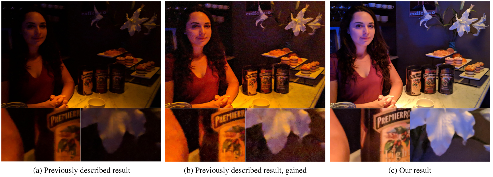

SIGGRAPH Asia 2019

Authors: [Orly Liba](https://sites.google.com/site/orlylibaprofessional/),
[Kiran Murthy](https://scholar.google.com/citations?user=6PhlPWMAAAAJ),
[Yun-Ta Tsai](https://ai.google/research/people/105312/),
[Timothy Brooks](https://www.timothybrooks.com/),
[Tianfan Xue](https://people.csail.mit.edu/tfxue/),
[Nikhil Karnad](https://scholar.google.com/citations?user=qgc_jY0AAAAJ),
[Qiurui He](https://scholar.google.com/citations?user=BxqV_RsAAAAJ),
[Jonathan T. Barron](https://jonbarron.info/),
[Dillon Sharlet](https://ai.google/research/people/105641/),
[Ryan Geiss](http://www.geisswerks.com/),
[Samuel W. Hasinoff](https://people.csail.mit.edu/hasinoff/),
[Yael Pritch](https://scholar.google.com/citations?user=2jXxOYQAAAAJ),
[Marc Levoy](http://graphics.stanford.edu/~levoy/)

## Abstract

Taking photographs in low light using a mobile phone is challenging and rarely
produces pleasing photographs.
Aside from the physical limits imposed by read noise and photon shot noise,
these cameras are typically handheld, have small apertures and sensors, use
mass-produced analog electronics that cannot easily be cooled, and are commonly
used to photograph subjects that move, like children and pets. In this paper we
describe a system for capturing clean, sharp, colorful photographs in light as
low as 0.3 lux, where human vision becomes monochrome and indistinct.
To permit handheld photography without flash illumination, we capture, align,
and combine multiple frames. Our system employs motion metering, which uses an
estimate of motion magnitudes (whether due to handshake or moving objects) to
identify the number of frames and the per-frame exposure times that together
minimize both noise and motion blur in a captured burst.
We combine these frames using robust alignment and merging techniques that have
been specialized for high-noise imagery.
To ensure accurate colors in such low light, we employ a learning-based auto
white balancing algorithm. To prevent the photographs from looking like they
were shot in daylight, we use tone mapping techniques inspired by illusionistic
painting: increasing contrast, crushing shadows to black, and surrounding the
scene with darkness. All of these processes are performed using the limited
computational resources of a mobile device.
Our system can be used by novice photographers to produce shareable pictures in
a few seconds based on a single shutter press, even in environments so dim that
humans cannot see clearly.

### Citation

Orly Liba, Kiran Murthy, Yun-Ta Tsai, Tim Brooks, Tianfan Xue, Nikhil Karnad, Qiurui He et al. "Handheld mobile photography in very low light." ACM Transactions on Graphics (TOG) 38, no. 6 (2019): 1-16.

## Downloads

Results on HDR+ dataset: coming soon [*]

arXiv: [https://arxiv.org/abs/1910.11336](https://arxiv.org/abs/1910.11336)

Presentation in SIGGRAPH Asia 2019: [link](http://sa2019.conference-program.com/presentation/?id=papers_182&sess=sess104)

[*] Note that an earlier version of these results (shared between Oct 29, 2019 and Jan 7, 2020) were compromised by a configuration error that affected older bursts. Please use the most recent results only.
